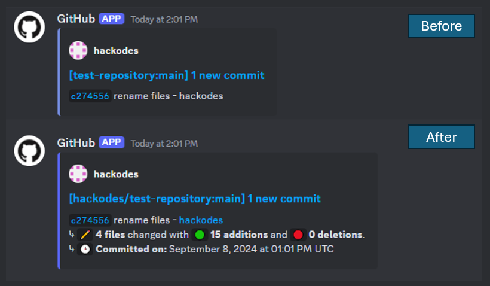
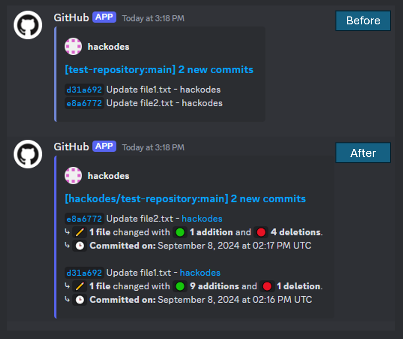

## GitHub to Discord Notifier Webhook

A serverless function that listens for GitHub webhook events, processes commit data from a repository, and sends formatted notifications to a Discord channel via a webhook URL. This project makes improvements to GitHub's built-in webhook integration by providing more detailed commit information, such as commit message, author, commit URL, additions, deletions, and file changes. It also allows customization of the bot's name, avatar, and embed color for Discord messages so you can customize the appearance of the notifications to suit your needs.

### How It Works

- Receives a POST request from GitHub when commits are pushed to a repository.
- Formats the commit information into a structured, readable message.
- Delivers the message to the specified Discord webhook URL as an embed message.

### Quick Start Guide

#### Clone and Deploy

- Clone this repository and push it to your GitHub account.
  
- Sign in to [Vercel](https://vercel.com), create a new project, and import the repository from GitHub.

#### Configure Environment Variables

Configure the `DISCORD_WEBHOOK_URL` and `GITHUB_ACCESS_TOKEN` environment variables. You can set these variables in the Vercel dashboard under `Settings` -> `Environment Variables`:

  - Create a new webhook in Discord under `Server Settings` -> `Integrations` -> `Webhooks`. Copy the URL and set it in the `DISCORD_WEBHOOK_URL` environment variable. This is the URL of your Discord webhook
  
  - Create a token in GitHub under `Settings` -> `Developer settings` -> `Personal access tokens` -> `Fine-grained tokens`. Ensure that the `Contents` permission has `Read only` access, and paste the token in the `GITHUB_ACCESS_TOKEN` environment variable. This is your GitHub access token which is for authenticating with the GitHub API and fetching commit data.

#### Deploy and Verify

- After deployment, Vercel will provide a domain URL (e.g., `your-app.vercel.app`). Visit the URL with `/api/` appended to verify the deployment. You should see a message like: `GitHub to Discord Notifier Webhook is running! 🚀` in the browser.  

- Copy and save the URL for setting up the GitHub webhook.

#### Set Up GitHub Webhook

- In your GitHub repository settings, navigate to `Settings` -> `Webhooks` -> `Add webhook`.

- In the `Payload URL` field, paste the Vercel URL with `/github` appended. For example, `https://your-app.vercel.app/api/github`.

- Set the `Content type` to `application/json`. Leave the `Secret` field empty.

- Choose the events you want to trigger the webhook. Select `Just the push event`, and click `Add webhook` to save.

#### Test the Integration

Push a commit to your GitHub repository and verify that a notification is sent to the Discord channel. If successful, you're all set! 

### Local Development Setup

To test the webhook locally, use a tool like [ngrok](https://ngrok.com/) to expose your local server to the internet.

- Download and install Ngrok from [Ngrok's download page](https://ngrok.com/download).

- Start your local server with `npm run dev` (this will run the server locally on `http://localhost:3000`).

- Run Ngrok with `ngrok http 3000` to expose your local server to the internet. Copy the public URL provided by Ngrok, e.g. `https://xxxxxx.ngrok.io`.

- Set the generated ngrok URL (e.g., `https://xxxxxx.ngrok.io/api/github`) in your GitHub webhook settings to start receiving webhook events locally.

### Contributing

Contributions are welcome! Feel free to open an issue or submit a pull request for suggestions, bug reports, or feature requests.